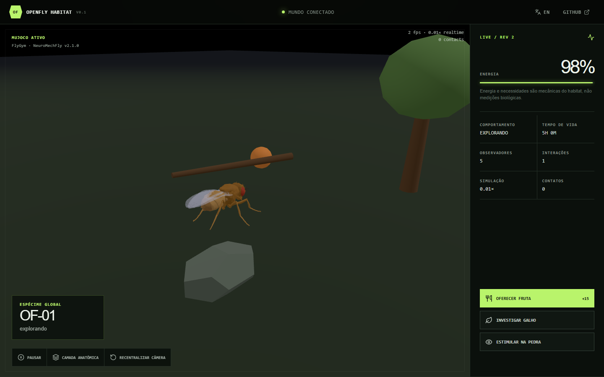

# Batista Colombi

Sou **Desenvolvedor de Software** e **Graduando em Ciência da Computação pela UFES**.

Atualmente, estou direcionando meus estudos e desenvolvimento profissional para **Android nativo com Kotlin**, aprofundando conhecimentos em arquitetura de software, boas práticas de desenvolvimento e construção de aplicações mobile.

Também possuo experiência no desenvolvimento de **produtos e soluções digitais**, participando desde o levantamento de requisitos e planejamento até desenvolvimento, integração e evolução dos sistemas.

---

##  Atualmente

- Focado em desenvolvimento **Android com Kotlin**
- Estudando arquitetura e boas práticas de desenvolvimento
- Desenvolvendo e evoluindo produtos e soluções digitais
- Concluindo Ciência da Computação na **UFES**
- Aprimorando conhecimentos em algoritmos e estruturas de dados

---

##  Tecnologias & Ferramentas

### Mobile

### Front-end

### Back-end & Dados

Desenvolvo integrações e APIs REST com foco em organização, regras de negócio e persistência de dados. Tenho experiência com **Node.js**, **Python**, **PostgreSQL** e **Supabase**, aplicando essas tecnologias na construção e evolução de produtos digitais.

### Ferramentas

---

## 🎯 Principais áreas de interesse

- Desenvolvimento Android
- Kotlin
- Arquitetura de Software
- Desenvolvimento de Produtos Digitais
- Back-end, APIs REST e integração de sistemas
- Modelagem e persistência de dados
- Inteligência Artificial aplicada a produtos
- Desenvolvimento Full Stack

---

## 🪰 OpenFly Habitat

Uma mosca-das-frutas biomecânica em um habitat digital compartilhado. A experiência utiliza o modelo científico **NeuroMechFly**, física real com **MuJoCo WebAssembly** e um backend persistente que mantém energia, comportamento e histórico entre visitantes.

[**Explorar o habitat →**](https://openfly-habitat-batista.batistacolombi25.chatgpt.site) · [**Contribuir no GitHub →**](https://github.com/batistaColombi/OpenFly-Habitat)

---

## 📊 Estatísticas

  

<table>
  <tr>
    <td width="50%">
      
    </td>
    <td width="50%">
      
    </td>
  </tr>
</table>

---
